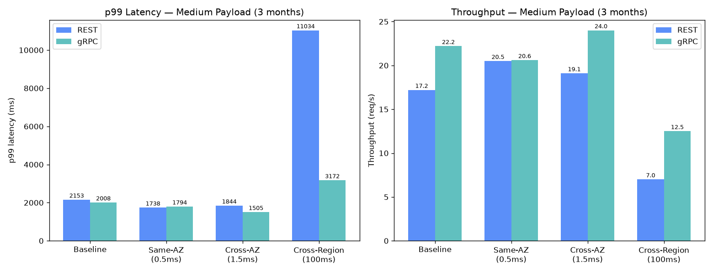
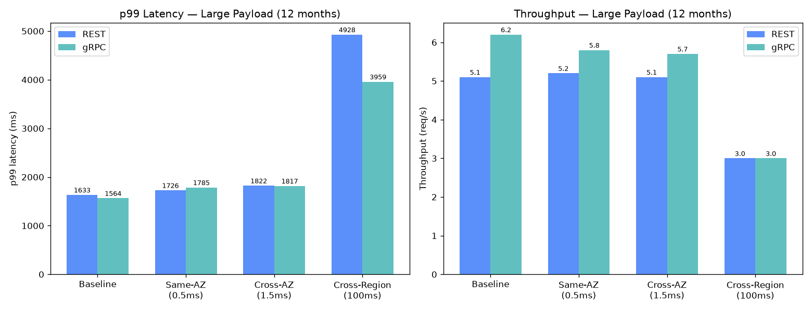
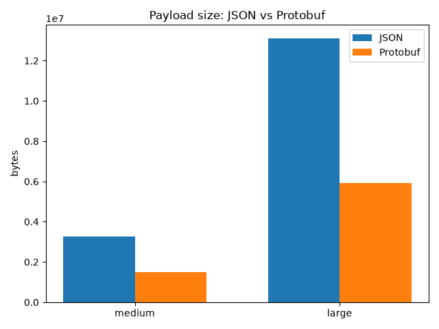
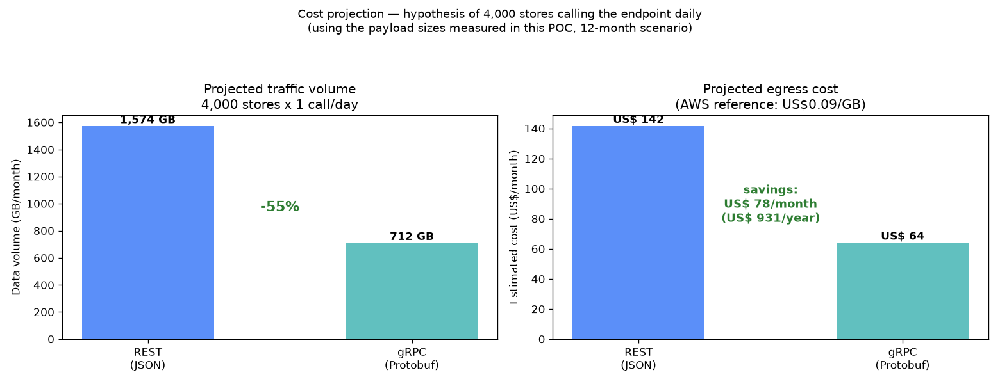
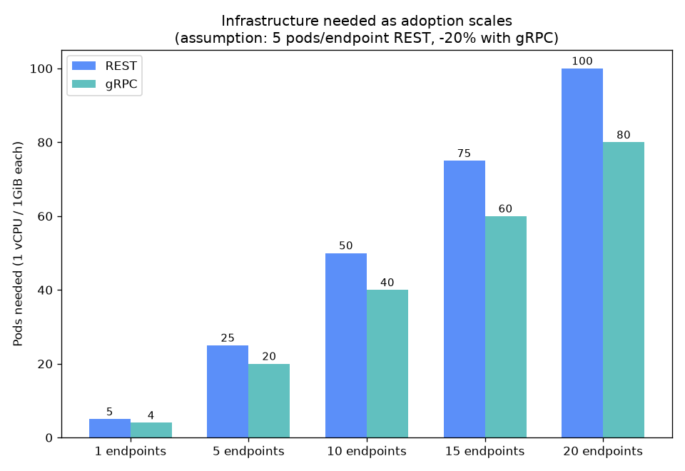
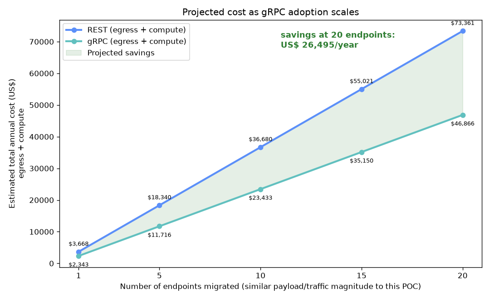
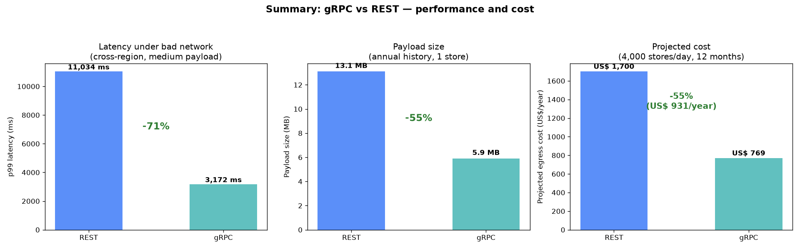

# POC: REST vs gRPC — Store Annual History

🌐 [Ler em português](RESULTS.md)

**Run date:** 2026-09-20
**Environment:** Local Docker Compose (Postgres 16, 2 Spring Boot 4.1 / Kotlin services, 2 nginx gateways simulating API Gateway and ALB), containers limited to 1 vCPU / 1GiB (EKS pod profile)

## 1. Objective and scenario

Performance comparison between REST (JSON) and gRPC (Protobuf) for the **same real use case**: querying a store's annual history, returning in a single response the aggregated monthly sales for the store's entire product catalog plus the period's promotions — the same shape that today comes out of an ETL pipeline, not individual transaction data.

The business logic is identical in both services (shared `sales-domain` module); the only difference is the exposition layer. Both services run behind gateways that simulate the real AWS topology: **API Gateway** in front of REST (with API-key authentication and rate limiting) and **ALB** in front of gRPC (without those layers, because API Gateway does not support gRPC pass-through natively — this asymmetry is intentional and discussed in section 5).

**Dataset:**
- 50 stores, shared catalog of 5,000 products, 12 months of history, 5 promotions/month per store
- Total: 3,000,000 aggregated monthly sales rows + 3,000 promotions
- Each benchmark request picks a random store among the 50 (round-robin for gRPC via `ghz`, random for REST via `k6`), simulating production traffic hitting different stores, not always the same one

**Payload scenarios** (varying the queried period for the same store):
- **Medium**: last 3 months → 15,000 sales + 15 promotions per response (~3.3 MB in JSON)
- **Large**: full 12 months → 60,000 sales + 60 promotions per response (~13.1 MB in JSON)

**Network conditions tested** (via `tc`/`netem` on the gateways, fixed delay with no jitter/loss — see the methodology note at the end): `baseline` (no shaping), `same-az` (0.5ms), `cross-az` (1.5ms), `cross-region` (100ms)

**Concurrency:** 20 simultaneous requests in the medium scenario, 5 in the large scenario — the large scenario is memory-bound (see section 4), so higher concurrency isn't realistic without more pod resources.

## 2. Latency and throughput

### Legend — what each column means

- **Protocol**: `REST` = JSON via `api-gateway-sim`; `gRPC` = Protobuf via `alb-grpc-sim`.
- **Scenario**: `medium` = 3-month query (15k sales + 15 promotions per response, ~3.3MB in JSON); `large` = 12-month query (60k sales + 60 promotions, ~13.1MB in JSON).
- **Network profile**: latency simulated between the gateway and the client via `tc`/`netem`, representing the real physical distance between client and service in an AWS deployment — `baseline` (no shaping; no added network latency beyond what Docker itself already imposes, the most favorable scenario possible), `same-az` (~0.5ms; two pods in the same availability zone), `cross-az` (~1.5ms; pods in different availability zones, same region), `cross-region` (~100ms; traffic between different AWS regions, e.g. a client in South America talking to a service in the US).
- **p50 / p95 / p99**: per-request latency percentiles, in milliseconds. **p50** is the median — half of requests were faster than this. **p95**/**p99** are the "tail" — the ceiling that 95%/99% of requests stayed under. Looking only at the median hides slowness spikes that affect a real fraction of users; that's why p99 matters as much as p50.
- **Throughput**: how many requests the service completed per second during the load test, with the concurrency level used in that scenario (20 for medium, 5 for large). The higher, the more traffic the same pod can handle.
- **Success**: percentage of requests that completed with a valid response within the test window.
- **gRPC advantage**: how much gRPC beat REST by, on each metric, in the same scenario/profile row. A **positive sign in any column means gRPC is better** (less latency, more throughput) — negative means REST came out ahead on that specific point.

| Protocol | Scenario | Network profile | p50 (ms) | p95 (ms) | p99 (ms) | Throughput (req/s) | Success | gRPC advantage |
|---|---|---|---|---|---|---|---|---|
| REST | medium | baseline | 1128 | 1756 | 2153 | 17.2 | 100% | |
| gRPC | medium | baseline | 839 | 1517 | 2008 | 22.2 | 100% | p50 +26% · p95 +14% · p99 +7% · thr +29% |
| REST | medium | same-az | 968 | 1407 | 1738 | 20.5 | 100% | |
| gRPC | medium | same-az | 917 | 1439 | 1794 | 20.6 | 100% | p50 +5% · p95 -2% · p99 -3% · thr +0% |
| REST | medium | cross-az | 1026 | 1632 | 1844 | 19.1 | 100% | |
| gRPC | medium | cross-az | 793 | 1282 | 1505 | 24.0 | 100% | p50 +23% · p95 +21% · p99 +18% · thr +26% |
| REST | medium | cross-region | 1876 | 5685 | **11034** | 7.0 | 100% | |
| gRPC | medium | cross-region | 1470 | 2494 | **3172** | 12.5 | 100% | p50 +22% · p95 +56% · p99 +71% · thr +79% |
| REST | large | baseline | 939 | 1316 | 1633 | 5.1 | 100% | |
| gRPC | large | baseline | 785 | 1155 | 1564 | 6.2 | 100% | p50 +16% · p95 +12% · p99 +4% · thr +22% |
| REST | large | same-az | 941 | 1534 | 1726 | 5.2 | 100% | |
| gRPC | large | same-az | 807 | 1233 | 1785 | 5.8 | 100% | p50 +14% · p95 +20% · p99 -3% · thr +12% |
| REST | large | cross-az | 932 | 1463 | 1822 | 5.1 | 100% | |
| gRPC | large | cross-az | 840 | 1377 | 1817 | 5.7 | 100% | p50 +10% · p95 +6% · p99 +0% · thr +12% |
| REST | large | cross-region | 1194 | 3416 | 4928 | 3.0 | 100% | |
| gRPC | large | cross-region | 1472 | 3251 | 3959 | 3.0 | 100% | p50 **-23%** · p95 +5% · p99 +20% · thr +0% |

*(Generated automatically by `benchmark/consolidate/consolidate.py` from `k6` and `ghz` output; see `benchmark/results/summary-latency.csv` for the full numbers and `benchmark/results/charts/` for the per-scenario charts. "gRPC advantage" column computed as `(REST - gRPC) / REST` for latency and `(gRPC - REST) / REST` for throughput.)*

**Reading the numbers — medium scenario (the most representative of real traffic patterns, at concurrency 20):**
- gRPC delivers **26% less p50 latency** and **29% more throughput** than REST already on the local network (baseline), with no adverse condition at all.
- The strongest result shows up under **cross-region**: REST's **p99 blows up to 11 seconds**, while gRPC stays at 3.2 seconds — a **71% reduction in tail latency**. gRPC's throughput is also **79% higher** under that condition. This happens because gRPC's multiplexed HTTP/2 amortizes the cost of extra round-trips that a slower network imposes better than REST/HTTP1.1 does, which pays that cost more directly per connection.

**Reading the numbers — large scenario (13MB payload, concurrency 5, memory-bound):**
- gRPC's advantage is more modest and less consistent: **10-16% lower p50 latency** and **11-21% more throughput** in baseline/same-az/cross-az.
- Under cross-region, the result flips on p50 (REST slightly faster), but gRPC still wins on p99 (~20% lower). With low concurrency (5) and very large payloads, the bottleneck shifts to being dominated by the time to serialize/hydrate 60,000 records on the JVM heap, which is roughly equal on both sides — the protocol advantage gets diluted.

**Conclusion for this section:** gRPC's gain is clear and grows as concurrency increases and the network gets worse — exactly the scenario of a real production API with multiple simultaneous clients and non-trivial network latency. For very large payloads at low concurrency, the gain still exists but is smaller, because the bottleneck stops being network/serialization and becomes server-side data processing.

## 3. Payload size (JSON vs Protobuf)

Measured byte-for-byte on the wire (not an estimate) via `benchmark/measure-payload-size.sh`, which uses the real serializer on each side — this matters because `grpcurl` alone shows the gRPC response re-rendered as JSON, not the actual binary size transmitted.

| Scenario | Store | JSON (bytes) | Protobuf (bytes) | Reduction |
|---|---|---|---|---|
| medium (3 months) | 1 | 3,280,037 (~3.3 MB) | 1,483,673 (~1.5 MB) | **54.8%** |
| large (12 months) | 1 | 13,119,848 (~13.1 MB) | 5,934,663 (~5.9 MB) | **54.8%** |

The reduction is practically identical in both scenarios (~55%), which makes sense: the payload structure (many repeated string fields per record — product name, store name, category, region) is the same, only the record count changes.

**Direct effect observed on network traffic during load:** monitoring `docker stats` during the large-scenario load tests at the same concurrency (5 simultaneous requests, ~20s), **REST transmitted ~1.5 GB of outbound traffic (egress)** versus **~0.7 GB for gRPC** — a **53% reduction** in network volume, consistent with the measured payload reduction.

## 4. CPU and memory under load

| Service | CPU under load (large scenario, concurrency 5) | Memory under load | Network egress (~20s of load) |
|---|---|---|---|
| sales-service-rest | ~100-106% of 1 vCPU (saturated) | 92-96% of 1GiB (near the limit) | ~1.5 GB |
| sales-service-grpc | ~65-101% of 1 vCPU (saturates as load ramps) | 87-96% of 1GiB (near the limit) | ~0.7 GB |

**Important finding, independent of protocol:** with the 12-month payload (60k sales + 60 promotions, ~13MB), **both services saturate CPU and approach the 1GiB memory limit with just 5 concurrent requests**. This isn't a REST or gRPC limitation — it's the result of holding 60,000 JPA entities + DTOs/protobuf objects in memory simultaneously for several concurrent requests, with only 1 vCPU/1GiB allocated to the pod.

This is an operational concern independent of the REST-vs-gRPC choice: **an endpoint that returns a store's full catalog in a single response will need more memory per pod, pagination, or streaming if concurrent production traffic is high** — switching protocols alone doesn't fix this memory bottleneck, even though gRPC does help relieve network pressure.

## 5. Trade-offs that don't show up in the numbers

An honest POC needs to admit where gRPC loses, even when the latency/payload numbers favor it. These points weren't measured quantitatively, but they're real and relevant to the decision:

- **Unreadable payload**: Protobuf is binary. You can't inspect a request with a quick `curl`, paste it into Postman and read it, or debug a payload captured in logs without a tool that understands the `.proto`. This has a real cost in debugging speed, especially for people who don't work with gRPC daily.
- **Stub generation and versioning**: the contract (`sales.proto`) needs to stay in sync between the teams publishing and consuming the service, with code generation on every build. This changes the development flow (you need to run codegen, version the `.proto` as part of the public API, watch out for field compatibility) in a way REST/JSON doesn't require.
- **Limited native gRPC support in browsers**: calling a gRPC service straight from the browser doesn't work without grpc-web (which in turn needs a proxy) or without going through a gateway that does the translation. If a future consumer is an SPA calling the service directly, that's an extra complication.
- **Gateway asymmetry on AWS**: as replicated in this POC, **API Gateway does not support gRPC pass-through** — in practice, adopting gRPC also means swapping the edge component (from API Gateway to ALB, or to a service mesh), which has security, observability, and operational implications that the platform team needs to plan for. It's not just swapping a library in the service.
- **Observability maturity**: tools like New Relic, and the dashboard/alert setup already configured for HTTP/REST, tend to have more mature and battle-tested support for REST than for gRPC. Adopting gRPC may require additional tracing/metrics configuration and a learning curve before reaching the same level of operational visibility that already exists today.
- **Message size limit**: gRPC has a default 4MB per-message limit (we had to explicitly raise it to 20MB in this POC to fit the 12-month response). It's one more setting the team needs to know about and deliberately tune, something REST doesn't impose by default.

## 6. Possible cost reduction

This is an order-of-magnitude estimate based on the measured numbers, not a precise financial forecast — the real values depend on the endpoint's actual production traffic volume.

**Data transfer (egress):** the ~55% payload size reduction translates directly into ~55% fewer bytes moving over the network. This matters in two places AWS charges for:
- **Egress to the internet** (external client consuming the API): public AWS reference ~US$0.09/GB (after the first 100GB/month free tier).
- **Cross-AZ/cross-region traffic** between internal services: public AWS reference ~US$0.01-0.02/GB.

### Simulation: 4,000 stores querying the endpoint 1x/day

To give a concrete sense of scale, we simulated (pure math over the bytes already measured in this POC — we did not run the application with 4,000 stores) the scenario of **4,000 stores calling the annual-history endpoint (12 months) once a day each**, using the real payload size measured in section 3 (13.1 MB JSON / 5.9 MB Protobuf per call):

| | REST (JSON) | gRPC (Protobuf) | Reduction |
|---|---|---|---|
| Volume per day | 52.5 GB | 23.7 GB | 54.8% |
| Volume per month (30 days) | 1,574 GB (~1.54 TB) | 712 GB (~0.70 TB) | 54.8% |
| Volume per year | 18.9 TB | 8.5 TB | 54.8% |
| Estimated monthly cost* | US$ 142 | US$ 64 | **US$ 78/month** |
| Estimated annual cost* | US$ 1,700 | US$ 769 | **US$ 931/year** |

*\*AWS reference of US$0.09/GB for internet egress — if the traffic is mostly internal (cross-AZ/region, ~US$0.015/GB), the values drop to ~US$24/US$11 per month (~US$155/year in savings), but the percentage reduction (54.8%) is the same regardless of the rate used.*

**Important — this is a linear extrapolation over this POC's current payload, not a production forecast.** A real production system typically has additional fields not present in this POC (sales curves, sales projections, deactivated items, among others), so the real production payload should be **significantly larger** than the ~13MB measured here. This doesn't invalidate the conclusion — quite the opposite: since Protobuf's reduction is a **percentage** of the payload size (not a fixed value), a larger production payload tends to keep (or even widen, if the extra fields also have a lot of string repetition) that same ~55% ratio, and the GB/US$ values would scale up proportionally. Before deciding, it's worth measuring the real production payload size and swapping the 13.1MB/5.9MB in this table for the real values.

For larger volumes (tens of thousands of stores, multiple calls/day), this number scales linearly and the absolute savings grow in the same proportion.

### Compute cost: fewer pods for the same throughput

This is probably the **strongest** cost argument in this POC, more so than egress — compute (EC2/Fargate/EKS) tends to be the largest line item on the infrastructure bill, not data transfer.

In the medium scenario (more representative of real traffic, at concurrency 20), gRPC sustained **20-29% more throughput** on the **same pod** (same CPU/memory, 1 vCPU/1GiB). That means fewer replicas would be needed to handle the same peak requests/second.

Example calculation (explicit assumptions below, adjust with your own environment's real numbers):
- Throughput gain considered: **20%** (conservative — we used the most consistent value across baseline/cross-az; the +79% peak under cross-region was not used, to avoid overestimating).
- Reference replicas per endpoint: **5 pods** of 1 vCPU/1GiB (illustrative assumption — swap for your service's real number).
- Reference pod cost: **AWS Fargate on-demand**, ~US$0.04048/vCPU-hour + ~US$0.004445/GB-hour ≈ **US$32.80/pod/month** (1 vCPU + 1GiB, running 24/7).

| | REST | gRPC | Reduction |
|---|---|---|---|
| Pods needed | 5.0 | 4.0 | -20% |
| Compute cost/year | US$ 1,968 | US$ 1,574 | **US$ 393/year** |

Adding compute + egress, **a single endpoint of this size saves ~US$1,325/year (36%)** — well more than the ~US$931/year from egress alone that we discussed earlier.

**In the large scenario (12-month payload, low concurrency), this logic doesn't apply**: both protocols saturate CPU and memory equally (section 4), so reducing pods there is risky (OOM risk) — the bottleneck is data volume per response, not the protocol. The compute reduction is defensible for endpoints with typical concurrent traffic (medium payload, many simultaneous calls), not for large, sporadic exports.

## 7. Scale scenario: adoption across multiple endpoints

What if this were adopted across the whole system, not just this one endpoint? This section simulates (math over the numbers already measured — no additional tests were run) the effect of applying the same gain pattern (egress + compute, assumptions from the previous section) to **N endpoints of similar magnitude** to this POC's.

| Endpoints migrated | REST cost/year | gRPC cost/year | Savings/year | REST pods | gRPC pods |
|---|---|---|---|---|---|
| 1 | US$ 3,668 | US$ 2,343 | US$ 1,325 | 5 | 4 |
| 5 | US$ 18,340 | US$ 11,717 | US$ 6,624 | 25 | 20 |
| **10** | **US$ 36,680** | **US$ 23,433** | **US$ 13,247** | 50 | 40 |
| 15 | US$ 55,021 | US$ 35,150 | US$ 19,871 | 75 | 60 |
| **20** | **US$ 73,361** | **US$ 46,866** | **US$ 26,495** | 100 | 80 |

**Directly answering the requested example:** with **10 endpoints** of payload/traffic similar to this POC's, the projected savings are **~US$13,250/year** (egress + compute combined) — and the required infrastructure drops from 50 to 40 pods.

**With 20 endpoints** (a plausible production scenario for a system with multiple query/reporting services), the projected savings reach **~US$26,500/year**, with **20 fewer pods** running permanently — that's infrastructure that stops existing, not just a smaller cost line: less surface to monitor, less reserved capacity, fewer objects for the platform team to manage.

**Read with caution:** this is an extrapolation assuming the other endpoints have similar payload/traffic magnitude to what was measured here, and that the 5-pods/endpoint assumption and the 20% throughput gain hold in practice. The goal of this chart isn't to predict the exact number, it's to show the **direction and order of magnitude** of the gain when the same pattern repeats at scale — your system's real number could be higher or lower, and should be recalculated with the real pods/traffic of each candidate endpoint.

**How to read this:** looking at the three numbers together — one endpoint's egress (~US$931/year), one endpoint's compute (~US$393/year), and the scale projection (~US$13-26k/year for 10-20 endpoints) — the cost argument only becomes robust **at scale**, applied to several high-traffic endpoints, not as justification for migrating a single isolated endpoint.

## 8. Conclusion and recommendation

**Where gRPC clearly pays off:**
- Endpoints with meaningful concurrent traffic (dozens of simultaneous requests) — the throughput gain (+20-29%) and the latency robustness under bad networks (71% lower p99 under cross-region) are differences end users would feel directly.
- Scenarios with clients in different regions/AZs from the service — the worse the network, the bigger gRPC's observed advantage.
- Where traffic volume (egress) is already large enough for the ~55% payload reduction to generate visible savings on the cloud bill.

**Where the gain is smaller or the trade-off weighs more:**
- Very-low-concurrency endpoints with very large payloads (the server's memory/CPU bottleneck dominates, not the protocol) — in that case, it's worth investing more in pagination/streaming than in switching protocols.
- If the team heavily depends on manual payload inspection (Postman, curl, logs) day-to-day — the binary's debugging cost is real and constant, while the performance gain is intermittent (only shows up under load/bad network).
- If there's no prior gRPC experience on the team or in the observability tooling (New Relic) — the learning curve and the work to enable tracing/metrics equivalent to what already exists for REST is a non-trivial adoption cost.
- Swapping the edge component (API Gateway → ALB) to support gRPC is a platform architecture decision, not just the application team's — it needs to be aligned beforehand.

**Recommendation:** the data supports **selective** adoption, not a blanket migration. It's worth considering gRPC specifically for internal endpoints (service-to-service, not exposed to a browser) with higher concurrent call volume and/or higher sensitivity to network latency — not for the team's entire API surface. Before migrating anything to production, validate: (1) the candidate endpoint's real traffic volume, to confirm whether the egress savings are significant; (2) whether the platform team already has (or is willing to build) the ALB/observability path for gRPC.

---

## Quick summary

> **How to read the "Change" column**: the sign indicates whether the number **dropped** (−) or **rose** (+) from REST to gRPC — it does not indicate whether that's good or bad. The "Result" column next to it already states that directly: on **every** row, the result is a gRPC improvement over REST.

| | REST (JSON) | gRPC (Protobuf) | Change | Result |
|---|---|---|---|---|
| p99 latency, bad network (cross-region) | 11,034 ms | 3,172 ms | -71% | ✅ gRPC 71% faster |
| Throughput, concurrent traffic (baseline) | 17.2 req/s | 22.2 req/s | +29% | ✅ gRPC handles 29% more requests/s |
| Payload size (annual history) | 13.1 MB | 5.9 MB | -55% | ✅ gRPC transmits 55% less data |
| Total cost (egress+compute), 1 endpoint/year | US$ 3,668 | US$ 2,343 | -36% | ✅ gRPC costs US$ 1,325/year less |
| Total cost (egress+compute), 20 endpoints/year | US$ 73,361 | US$ 46,866 | -36% | ✅ gRPC costs US$ 26,495/year less |
| Pods needed, 20 endpoints | 100 | 80 | -20 pods | ✅ gRPC needs 20 fewer pods |

gRPC's gain is consistent across three fronts: **performance** (more throughput, much less latency degradation under bad networks), **direct cost** (payload and egress ~55% smaller), and **infrastructure cost** (fewer pods for the same throughput, an effect that only becomes financially relevant when applied across several endpoints — see section 7). The caveat is the operational trade-offs from section 5 — debuggability, stub generation, and the edge-component swap (API Gateway → ALB) — which are real adoption costs and don't show up in any of these charts.

---

## Methodology note

- The network profiles use **fixed delay, with no jitter or packet loss**. Initial tests with jitter (`delay 100ms 20ms`) and simulated loss (`loss 0.05%`) caused pathological TCP retransmit stalls in Docker Desktop's virtualized environment (a single 3MB request took as long as 80 seconds), disproportionate to what a real cross-region condition would cause. Fixed delay still captures the per-round-trip latency effect these profiles exist to demonstrate, without that artifact.
- Both services' containers run with `-XX:MaxRAMPercentage=75.0` explicitly set — the JVM default (25% of the container limit) would leave insufficient heap (~256MB out of a 1GiB limit) for this endpoint, causing `OutOfMemoryError` in both services regardless of protocol. This is a real production configuration any Java pod on Kubernetes should have, not a special tweak to favor one side of the comparison.
- All tests had a warm-up round before measurement, to avoid JIT warm-up/connection-pool initialization costs skewing the first numbers.

---

## 9. Market view: gRPC beyond this POC

Everything up to here came from our own tests. This section is different: it's not about the POC, it's about **what the industry has already publicly documented** about gRPC in production.

### Why gRPC tends to win on performance and operational cost, generally speaking

- **Multiplexed HTTP/2**: multiple calls on the same TCP connection, without the overhead of opening a new connection per request (the classic HTTP/1.1 problem that traditional REST relies on) — the same technical reason behind the bad-network latency result we measured in section 2.
- **Binary serialization (Protobuf)**: smaller payload and lower CPU cost to serialize/deserialize than parsing JSON text — the same reason behind the ~55% payload reduction we measured in section 3.
- **Strongly-typed contract**: the `.proto` acts as a contract checked at build time, reducing integration bugs between services (renamed field, wrong type) that would only surface at runtime with JSON — this is an indirect operational cost (fewer incidents, less rework) that a short-term POC can't measure, but is widely cited by teams that adopt gRPC internally.
- **Native streaming** (not tested in this POC): gRPC supports bidirectional streaming natively, which opens room for future optimizations (e.g. streaming sales history as it's computed, instead of waiting for everything to be ready) — something REST doesn't do without alternative solutions (WebSockets, long polling).

### Companies using gRPC in production (public sources)

| Company | Documented use | Source |
|---|---|---|
| **Google** | Creator of gRPC (evolution of the internal "Stubby" framework), uses it internally at large scale | [About gRPC](https://grpc.io/about/) |
| **Square (Block)** | Replaced their own RPC solution with gRPC — cite proven performance and multi-platform support as motivators | [About gRPC — case study](https://grpc.io/about/), [Square Engineering Blog](https://medium.com/square-corner-blog/grpc-cross-platform-open-source-rpc-over-http-2-56c03b5a0173) |
| **Netflix** | Uses Protobuf/gRPC in internal API design (e.g. using Protobuf FieldMask to optimize partial responses) | [Netflix TechBlog — Practical API Design at Netflix, Part 1](https://netflixtechblog.com/practical-api-design-at-netflix-part-1-using-protobuf-fieldmask-35cfdc606518) |
| **Uber** | Built a gRPC-based API gateway (on top of Envoy) for traffic between apps and back-end services | [Uber Engineering — The Architecture of Uber's API Gateway](https://www.uber.com/blog/architecture-api-gateway/) |
| **Cloudflare, Datadog, Coinbase, DoorDash, Salesforce, Expedia Group, GIPHY, Toast** | Adoption cases officially documented by the gRPC project itself (CNCF) | [gRPC Showcase](https://grpc.io/showcase/) |

Other widely known examples, documented in the tools' own infrastructure (not cited here via a dedicated article, but well-established public/technical knowledge): **etcd** (the configuration "database" behind every Kubernetes cluster exposes its v3 API via gRPC) and **containerd** (the container runtime used by Docker/Kubernetes exposes its API via gRPC).

The argument here isn't "these companies are just like ours" — it's that gRPC **is not an experimental or niche technology** — it's used in production, at scale, by tech companies with dedicated performance teams (Google, Netflix, Uber, Square), which lowers the perceived risk of adoption. It's worth complementing this list with your own search for cases in a similar industry/size to your own company, if any exist, to bring the argument even closer to your team's reality.
