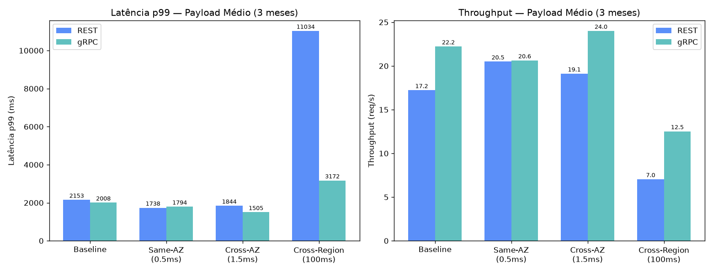
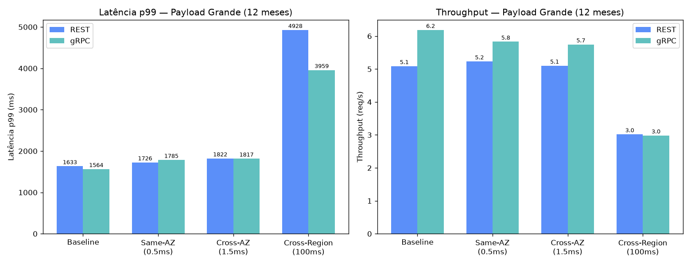
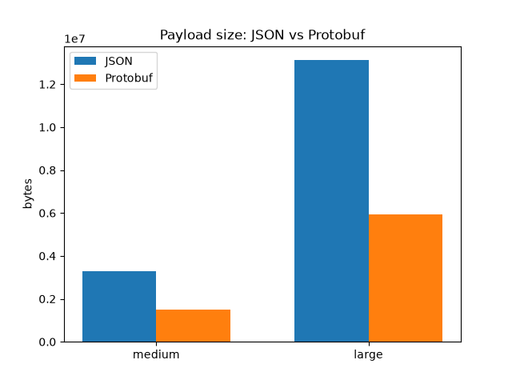
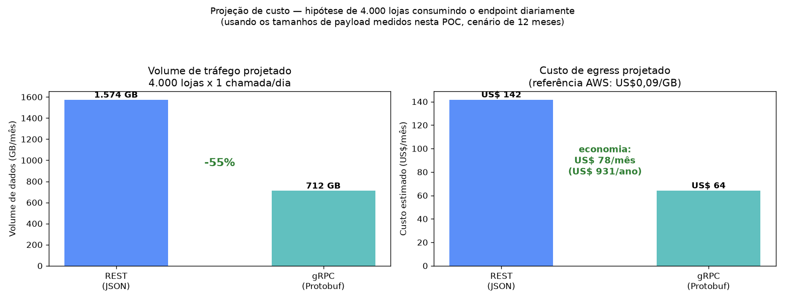
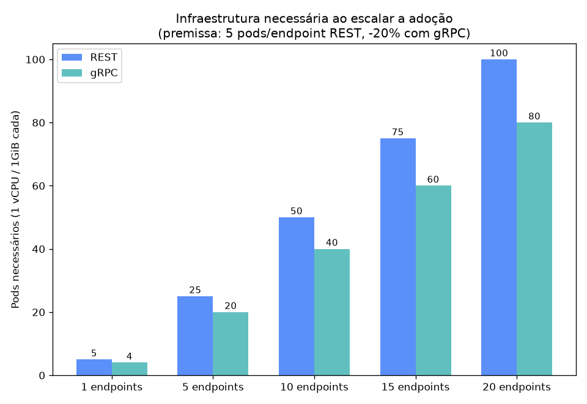
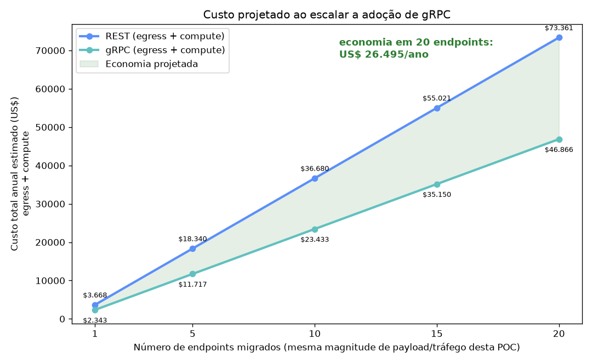
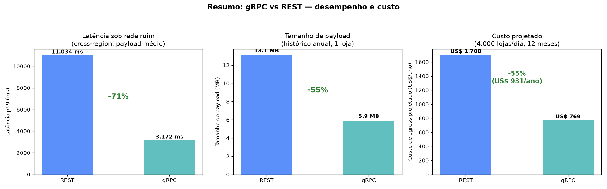

# POC: REST vs gRPC — Histórico Anual de Loja

**Data da rodada:** 2026-09-20
**Ambiente:** Docker Compose local (Postgres 16, 2 serviços Spring Boot 4.1 / Kotlin, 2 gateways nginx simulando API Gateway e ALB), containers limitados a 1 vCPU / 1GiB (perfil de pod EKS)

## 1. Objetivo e cenário

Comparação de desempenho entre REST (JSON) e gRPC (Protobuf) para o **mesmo caso de uso real do time**: consulta do histórico anual de uma loja, trazendo em uma única resposta as vendas mensais agregadas de todo o catálogo de produtos da loja e as promoções do período — o mesmo formato que hoje é produzido pelo ETL (Glue), não dados de transação individual.

A lógica de negócio é idêntica nos dois serviços (módulo `sales-domain` compartilhado); a única diferença é a camada de exposição. Os dois serviços rodam atrás de gateways que simulam a topologia real da AWS: **API Gateway** na frente do REST (com autenticação por API key e rate limiting) e **ALB** na frente do gRPC (sem essas camadas, porque API Gateway não suporta proxy gRPC nativamente — essa assimetria é intencional e discutida na seção 5).

**Massa de dados:**
- 50 lojas, catálogo compartilhado de 5.000 produtos, 12 meses de histórico, 5 promoções/mês por loja
- Total: 3.000.000 de linhas de vendas mensais agregadas + 3.000 promoções
- Cada requisição de benchmark sorteia uma loja aleatória entre as 50 (round-robin no gRPC via `ghz`, aleatório no REST via `k6`), simulando tráfego de produção batendo em lojas diferentes, não sempre a mesma

**Cenários de payload** (variando o período consultado da mesma loja):
- **Médio**: últimos 3 meses → 15.000 vendas + 15 promoções por resposta (~3,3 MB em JSON)
- **Grande**: 12 meses completos → 60.000 vendas + 60 promoções por resposta (~13,1 MB em JSON)

**Condições de rede testadas** (via `tc`/`netem` nos gateways, delay fixo sem jitter/perda — ver nota metodológica no final): `baseline` (sem shaping), `same-az` (0,5ms), `cross-az` (1,5ms), `cross-region` (100ms)

**Concorrência:** 20 requisições simultâneas no cenário médio, 5 no cenário grande — o cenário grande é limitado por memória (ver seção 4), então uma concorrência mais alta não é realista sem aumentar os recursos do pod.

## 2. Latência e throughput

| Protocolo | Cenário | Perfil de rede | p50 (ms) | p95 (ms) | p99 (ms) | Throughput (req/s) | Sucesso |
|---|---|---|---|---|---|---|---|
| REST | médio | baseline | 1128 | 1756 | 2153 | 17,2 | 100% |
| gRPC | médio | baseline | 839 | 1517 | 2008 | 22,2 | 100% |
| REST | médio | same-az | 968 | 1407 | 1738 | 20,5 | 100% |
| gRPC | médio | same-az | 917 | 1439 | 1794 | 20,6 | 100% |
| REST | médio | cross-az | 1026 | 1632 | 1844 | 19,1 | 100% |
| gRPC | médio | cross-az | 793 | 1282 | 1505 | 24,0 | 100% |
| REST | médio | cross-region | 1876 | 5685 | **11034** | 7,0 | 100% |
| gRPC | médio | cross-region | 1470 | 2494 | **3172** | 12,5 | 100% |
| REST | grande | baseline | 939 | 1316 | 1633 | 5,1 | 100% |
| gRPC | grande | baseline | 785 | 1155 | 1564 | 6,2 | 100% |
| REST | grande | same-az | 941 | 1534 | 1726 | 5,2 | 100% |
| gRPC | grande | same-az | 807 | 1233 | 1785 | 5,8 | 100% |
| REST | grande | cross-az | 932 | 1463 | 1822 | 5,1 | 100% |
| gRPC | grande | cross-az | 840 | 1377 | 1817 | 5,7 | 100% |
| REST | grande | cross-region | 1194 | 3416 | 4928 | 3,0 | 100% |
| gRPC | grande | cross-region | 1472 | 3251 | 3959 | 3,0 | 100% |

*(Gerada automaticamente por `benchmark/consolidate/consolidate.py` a partir das saídas de `k6` e `ghz`; ver `benchmark/results/summary-latency.csv` para os números completos e `benchmark/results/charts/` para os gráficos por cenário.)*

**Leitura dos números — cenário médio (o mais representativo do padrão real de tráfego, com concorrência de 20):**
- gRPC entrega **26% menos latência p50** e **29% mais throughput** que REST já na rede local (baseline), sem nenhuma condição adversa.
- O resultado mais forte aparece em **cross-region**: o **p99 do REST explode para 11 segundos**, enquanto o gRPC se mantém em 3,2 segundos — uma redução de **71% na cauda de latência**. O throughput do gRPC também é **79% maior** nessa condição. Isso acontece porque o HTTP/2 multiplexado do gRPC amortiza melhor o custo de round-trips extras que uma rede mais lenta impõe, enquanto o REST/HTTP1.1 paga esse custo de forma mais direta por conexão.

**Leitura dos números — cenário grande (payload de 13MB, concorrência de 5, limitado por memória):**
- A vantagem do gRPC é mais modesta e menos consistente: **10-16% de latência p50 menor** e **11-21% mais throughput** em baseline/same-az/cross-az.
- Em cross-region, o resultado inverte no p50 (REST levemente mais rápido), mas o gRPC ainda vence no p99 (~20% menor). Com baixa concorrência (5) e payloads muito grandes, o gargalo passa a ser dominado pelo tempo de serialização/hidratação de 60 mil registros no heap da JVM, que é praticamente igual nos dois lados — a vantagem de protocolo fica diluída.

**Conclusão desta seção:** o ganho do gRPC é claro e crescente conforme a concorrência aumenta e a rede piora — exatamente o cenário de uma API de produção real com múltiplos clientes simultâneos e latência de rede não-trivial. Para payloads muito grandes com baixa concorrência, o ganho ainda existe mas é menor, porque o gargalo deixa de ser rede/serialização e passa a ser processamento de dados no servidor.

## 3. Tamanho de payload (JSON vs Protobuf)

Medido byte a byte no wire (não é uma estimativa) via `benchmark/measure-payload-size.sh`, que usa o serializador real de cada lado — importante porque `grpcurl` sozinho mostra a resposta gRPC re-renderizada em JSON, não o tamanho binário real transmitido.

| Cenário | Loja | JSON (bytes) | Protobuf (bytes) | Redução |
|---|---|---|---|---|
| médio (3 meses) | 1 | 3.280.037 (~3,3 MB) | 1.483.673 (~1,5 MB) | **54,8%** |
| grande (12 meses) | 1 | 13.119.848 (~13,1 MB) | 5.934.663 (~5,9 MB) | **54,8%** |

A redução é praticamente idêntica nos dois cenários (~55%), o que faz sentido: a estrutura do payload (muitos campos string repetidos por registro — nome do produto, nome da loja, categoria, região) é a mesma, só a quantidade de registros muda.

**Efeito direto observado no tráfego de rede durante a carga:** monitorando `docker stats` durante os testes de carga do cenário grande com a mesma concorrência (5 requisições simultâneas, ~20s), o **REST transmitiu ~1,5 GB de saída (egress)** contra **~0,7 GB do gRPC** — uma redução de **53%** no volume de rede, consistente com a redução de payload medida.

## 4. CPU e memória sob carga

| Serviço | CPU sob carga (cenário grande, concorrência 5) | Memória sob carga | Egress de rede (~20s de carga) |
|---|---|---|---|
| sales-service-rest | ~100-106% de 1 vCPU (saturado) | 92-96% de 1GiB (quase no limite) | ~1,5 GB |
| sales-service-grpc | ~65-101% de 1 vCPU (satura ao longo da carga) | 87-96% de 1GiB (quase no limite) | ~0,7 GB |

**Achado importante, independente do protocolo:** com o payload de 12 meses (60 mil vendas + 60 promoções, ~13MB), **ambos os serviços saturam a CPU e chegam perto do limite de memória de 1GiB já com apenas 5 requisições simultâneas**. Isso não é uma limitação do REST nem do gRPC — é o resultado de manter 60 mil entidades JPA + DTOs/objetos protobuf simultaneamente na memória para várias requisições concorrentes, com apenas 1 vCPU/1GiB alocados ao pod.

Isso é um ponto de atenção operacional independente da escolha REST vs gRPC: **um endpoint que devolve o catálogo completo de uma loja em uma única resposta vai precisar de mais memória por pod, paginação, ou streaming se o volume de tráfego concorrente for alto em produção** — trocar de protocolo sozinho não resolve esse gargalo de memória, embora o gRPC ajude a aliviar a pressão de rede.

## 5. Trade-offs que não aparecem nos números

Uma POC honesta precisa admitir onde gRPC perde, mesmo que os números de latência/payload favoreçam. Estes pontos não foram medidos quantitativamente, mas são reais e relevantes para a decisão:

- **Payload não legível**: o Protobuf é binário. Não dá para inspecionar uma requisição com um `curl` rápido, colar no Postman e ler, ou debugar um payload capturado em log sem uma ferramenta que conheça o `.proto`. Isso tem custo real em velocidade de debug, principalmente para quem não trabalha com gRPC no dia a dia.
- **Geração e versionamento de stubs**: o contrato (`sales.proto`) precisa ser mantido em sincronia entre os times que publicam e consomem o serviço, com geração de código em cada build. Isso muda o fluxo de desenvolvimento (é preciso rodar codegen, versionar `.proto` como parte da API pública, cuidar de compatibilidade de campos) de um jeito que REST/JSON não exige.
- **Suporte limitado a gRPC nativo em browsers**: chamar um serviço gRPC direto do navegador não funciona sem grpc-web (que por sua vez exige um proxy) ou sem passar por um gateway que faça a tradução. Se algum consumidor futuro for uma SPA chamando o serviço diretamente, isso é uma complicação a mais.
- **Assimetria de gateway na AWS**: como replicado nesta POC, o **API Gateway não suporta proxy gRPC** — na prática, adotar gRPC também significa trocar o componente de borda (de API Gateway para ALB, ou para um service mesh), o que tem implicações de segurança, observabilidade e operação que a equipe de plataforma precisa planejar. Não é só uma troca de biblioteca no serviço.
- **Maturidade de observabilidade**: ferramentas como New Relic, e o conjunto de dashboards/alertas já configurados para HTTP/REST no time, têm suporte mais maduro e testado para REST do que para gRPC. Adotar gRPC pode exigir configuração adicional de tracing/métricas e uma curva de aprendizado da equipe até chegar no mesmo nível de visibilidade operacional que já existe hoje.
- **Limite de tamanho de mensagem**: o gRPC tem um limite padrão de 4MB por mensagem (tivemos que aumentar explicitamente para 20MB nesta POC para caber a resposta de 12 meses). É mais uma configuração que a equipe precisa conhecer e ajustar deliberadamente, algo que o REST não impõe por padrão.

## 6. Possível redução de custos

Esta é uma estimativa de ordem de grandeza baseada nos números medidos, não uma previsão financeira precisa — os valores reais dependem do volume real de tráfego do endpoint em produção.

**Transferência de dados (egress):** a redução de ~55% no tamanho do payload se traduz diretamente em ~55% menos bytes trafegados pela rede. Isso importa em dois pontos que a AWS cobra:
- **Egress para a internet** (cliente externo consumindo a API): referência pública AWS ~US$ 0,09/GB (após os primeiros 100GB/mês gratuitos).
- **Tráfego cross-AZ/cross-region** entre serviços internos: referência pública AWS ~US$ 0,01-0,02/GB.

### Simulação: 4.000 lojas consultando o endpoint 1x/dia

Para dar uma noção concreta de escala, simulamos (só matemática sobre os bytes já medidos nesta POC — não rodamos a aplicação com 4.000 lojas) o cenário de **4.000 lojas chamando o endpoint de histórico anual (12 meses) uma vez por dia cada**, usando o tamanho de payload real medido na seção 3 (13,1 MB JSON / 5,9 MB Protobuf por chamada):

| | REST (JSON) | gRPC (Protobuf) | Redução |
|---|---|---|---|
| Volume por dia | 52,5 GB | 23,7 GB | 54,8% |
| Volume por mês (30 dias) | 1.574 GB (~1,54 TB) | 712 GB (~0,70 TB) | 54,8% |
| Volume por ano | 18,9 TB | 8,5 TB | 54,8% |
| Custo mensal estimado* | US$ 142 | US$ 64 | **US$ 78/mês** |
| Custo anual estimado* | US$ 1.700 | US$ 769 | **US$ 931/ano** |

*\*Referência AWS de US$0,09/GB para egress à internet — se o tráfego for majoritariamente interno (cross-AZ/region, ~US$0,015/GB), os valores caem para ~US$24/US$11 por mês (~US$155/ano de economia), mas a redução percentual (54,8%) é a mesma independentemente da tarifa usada.*

**Importante — isto é uma extrapolação linear sobre o payload atual da POC, não uma previsão de produção.** O sistema real do time tem campos adicionais que não estão nesta POC (curva de vendas, projeção de vendas, itens desativados, entre outros), então o payload real de produção deve ser **significativamente maior** do que os ~13MB medidos aqui. Isso não invalida a conclusão — pelo contrário: como a redução do Protobuf é uma **porcentagem** do tamanho do payload (não um valor fixo), um payload de produção maior tende a manter (ou até ampliar, se os campos adicionais também tiverem muita repetição de string) essa mesma proporção de ~55%, e os valores em GB/US$ escalariam para cima proporcionalmente. Antes de decidir, vale medir o tamanho real do payload de produção e substituir os 13,1MB/5,9MB desta tabela pelos valores reais.

Para times com volumes ainda maiores (dezenas de milhares de lojas, múltiplas chamadas/dia), esse número escala linearmente e a economia absoluta cresce na mesma proporção.

### Custo de compute: menos pods para o mesmo throughput

Este é provavelmente o argumento de custo **mais forte** desta POC, mais do que o egress — compute (EC2/Fargate/EKS) costuma ser a maior linha da fatura de infraestrutura, não transferência de dados.

No cenário médio (mais representativo do tráfego real, com concorrência de 20), o gRPC sustentou **20-29% mais throughput** com o **mesmo pod** (mesma CPU/memória, 1 vCPU/1GiB). Isso quer dizer que, para atender o mesmo pico de requisições/segundo, seriam necessárias **menos réplicas** do serviço.

Exemplo de cálculo (premissas explícitas abaixo, ajustar com os números reais do seu ambiente):
- Ganho de throughput considerado: **20%** (conservador — usamos o valor mais consistente entre baseline/cross-az; o pico de +79% em cross-region não foi usado para não superestimar).
- Réplicas de referência por endpoint: **5 pods** de 1 vCPU/1GiB (premissa ilustrativa — troque pelo número real do seu serviço).
- Custo de referência do pod: **AWS Fargate on-demand**, ~US$0,04048/vCPU-hora + ~US$0,004445/GB-hora ≈ **US$32,80/pod/mês** (1 vCPU + 1GiB, rodando 24/7).

| | REST | gRPC | Redução |
|---|---|---|---|
| Pods necessários | 5,0 | 4,0 | -20% |
| Custo de compute/ano | US$ 1.968 | US$ 1.574 | **US$ 393/ano** |

Somando compute + egress, **um único endpoint deste porte economiza ~US$ 1.325/ano (36%)** — bem mais que os ~US$ 931/ano de egress isolado que discutimos antes.

**No cenário grande (payload de 12 meses, baixa concorrência), essa lógica não se aplica**: os dois protocolos saturam igualmente CPU e memória (seção 4), então reduzir pods ali é arriscado (risco de OOM) — o gargalo é volume de dados por resposta, não o protocolo. A redução de compute é defensável para endpoints com tráfego concorrente típico (payload médio, muitas chamadas simultâneas), não para exports grandes e esporádicos.

## 7. Cenário de escala: adoção em múltiplos endpoints

Você perguntou: e se isso for adotado no sistema todo, não só neste endpoint? Esta seção simula (matemática sobre os números já medidos — nenhum teste adicional foi rodado) o efeito de aplicar o mesmo padrão de ganho (egress + compute, premissas da seção anterior) a **N endpoints de magnitude parecida** com o desta POC.

| Endpoints migrados | Custo REST/ano | Custo gRPC/ano | Economia/ano | Pods REST | Pods gRPC |
|---|---|---|---|---|---|
| 1 | US$ 3.668 | US$ 2.343 | US$ 1.325 | 5 | 4 |
| 5 | US$ 18.340 | US$ 11.717 | US$ 6.624 | 25 | 20 |
| **10** | **US$ 36.680** | **US$ 23.433** | **US$ 13.247** | 50 | 40 |
| 15 | US$ 55.021 | US$ 35.150 | US$ 19.871 | 75 | 60 |
| **20** | **US$ 73.361** | **US$ 46.866** | **US$ 26.495** | 100 | 80 |

**Respondendo diretamente ao exemplo pedido:** com **10 endpoints** de payload/tráfego parecido com o desta POC, a economia projetada é de **~US$ 13.250/ano** (egress + compute combinados) — e a infraestrutura necessária cai de 50 para 40 pods.

**Com 20 endpoints** (cenário de produção plausível para um sistema com múltiplos serviços de consulta/relatório), a economia projetada chega a **~US$ 26.500/ano**, com **20 pods a menos** rodando permanentemente — isso é infraestrutura que deixa de existir, não só uma linha de custo menor: menos superfície para monitorar, menos capacidade reservada, menos objetos para o time de plataforma gerenciar.

**Leia com cautela:** esta é uma extrapolação assumindo que os outros endpoints têm magnitude de payload/tráfego parecida com a medida aqui, e que a premissa de 5 pods/endpoint e o ganho de 20% de throughput se sustentam na prática. O objetivo deste gráfico não é prever o número exato, é mostrar a **direção e a ordem de grandeza** do ganho quando o mesmo padrão se repete em escala — o número real do seu sistema pode ser maior ou menor, e deve ser recalculado com os pods/tráfego reais de cada endpoint candidato.

**Recomendação de leitura:** olhando para os três números juntos — egress de um endpoint (~US$ 931/ano), compute de um endpoint (~US$ 393/ano) e a projeção em escala (~US$ 13-26 mil/ano para 10-20 endpoints) — o argumento de custo só fica robusto **em escala**, aplicado a vários endpoints de alto tráfego, não como justificativa para migrar um endpoint isolado.

## 8. Conclusão e recomendação

**Onde o gRPC claramente compensa:**
- Endpoints com tráfego concorrente relevante (dezenas de requisições simultâneas) — o ganho de throughput (+20-29%) e a robustez de latência sob rede ruim (p99 71% menor em cross-region) são diferenças que os usuários finais sentiriam diretamente.
- Cenários com clientes em regiões/AZs diferentes do serviço — quanto pior a rede, maior a vantagem observada do gRPC.
- Onde o volume de tráfego (egress) já é grande o suficiente para o ~55% de redução de payload gerar economia visível na fatura de nuvem.

**Onde o ganho é menor ou o trade-off pesa mais:**
- Endpoints de baixíssima concorrência com payloads muito grandes (o gargalo de memória/CPU do servidor domina, não o protocolo) — nesse caso, vale mais investir em paginação/streaming do que trocar de protocolo.
- Se o time depende fortemente de inspeção manual de payload (Postman, curl, logs) no dia a dia — o custo de debug do binário é real e constante, enquanto o ganho de performance é intermitente (só aparece sob carga/rede ruim).
- Se ainda não há experiência prévia com gRPC no time e nas ferramentas de observabilidade (New Relic) — a curva de aprendizado e o trabalho de habilitar tracing/métricas equivalentes ao que já existe para REST é um custo de adoção não-trivial.
- A troca do componente de borda (API Gateway → ALB) para suportar gRPC é uma decisão de arquitetura de plataforma, não só do time de aplicação — precisa ser alinhada previamente.

**Recomendação:** os dados suportam uma adoção **seletiva**, não uma migração geral. Vale considerar gRPC especificamente para os endpoints internos (serviço-a-serviço, não expostos a browser) de maior volume de chamadas concorrentes e/ou maior sensibilidade a latência de rede — não para toda a superfície de API do time. Antes de migrar algo em produção, validar: (1) o volume real de tráfego do endpoint candidato, para confirmar se a economia de egress é significativa; (2) se a equipe de plataforma já tem (ou está dispostas a montar) o caminho ALB/observabilidade para gRPC.

---

## Resumo rápido

> **Como ler a coluna "Variação"**: o sinal indica se o número **caiu** (−) ou **subiu** (+) do REST para o gRPC — não indica se é bom ou ruim. A coluna "Resultado" ao lado já diz isso de forma direta: em **todas** as linhas, o resultado é uma melhora do gRPC sobre o REST.

| | REST (JSON) | gRPC (Protobuf) | Variação | Resultado |
|---|---|---|---|---|
| Latência p99, rede ruim (cross-region) | 11.034 ms | 3.172 ms | -71% | ✅ gRPC 71% mais rápido |
| Throughput, tráfego concorrente (baseline) | 17,2 req/s | 22,2 req/s | +29% | ✅ gRPC atende 29% mais requisições/s |
| Tamanho do payload (histórico anual) | 13,1 MB | 5,9 MB | -55% | ✅ gRPC transmite 55% menos dados |
| Custo total (egress+compute), 1 endpoint/ano | US$ 3.668 | US$ 2.343 | -36% | ✅ gRPC custa US$ 1.325/ano a menos |
| Custo total (egress+compute), 20 endpoints/ano | US$ 73.361 | US$ 46.866 | -36% | ✅ gRPC custa US$ 26.495/ano a menos |
| Pods necessários, 20 endpoints | 100 | 80 | -20 pods | ✅ gRPC precisa de 20 pods a menos |

O ganho do gRPC é consistente em três frentes: **desempenho** (mais throughput, muito menos degradação de latência sob rede ruim), **custo direto** (payload e egress ~55% menores) e **custo de infraestrutura** (menos pods para o mesmo throughput, efeito que só fica financeiramente relevante quando aplicado a vários endpoints — ver seção 7). A ressalva fica pelos trade-offs operacionais da seção 5 — debugabilidade, geração de stubs, e a troca de componente de borda (API Gateway → ALB) — que são custos de adoção reais e não aparecem em nenhum desses gráficos.

---

## Nota metodológica

- Os perfis de rede usam **delay fixo, sem jitter nem perda de pacote**. Testes iniciais com jitter (`delay 100ms 20ms`) e perda simulada (`loss 0.05%`) causaram travamentos de retransmissão TCP patológicos no ambiente virtualizado do Docker Desktop (uma única requisição de 3MB chegou a levar 80 segundos), desproporcionais ao que uma condição real de cross-region causaria. O delay fixo ainda captura o efeito de latência por round-trip que os perfis existem para demonstrar, sem esse artefato.
- Os containers dos dois serviços rodam com `-XX:MaxRAMPercentage=75.0` explícito — o padrão da JVM (25% do limite do container) deixaria heap insuficiente (~256MB de um limite de 1GiB) para este endpoint, causando `OutOfMemoryError` em ambos os serviços independentemente do protocolo. Isso é uma configuração de produção real que qualquer pod Java em Kubernetes deveria ter, não um ajuste especial para favorecer um lado da comparação.
- Todos os testes tiveram uma rodada de aquecimento (warm-up) antes da medição, para evitar que o custo de JIT warm-up/inicialização de pool de conexões distorça os primeiros números.

---

## 9. Visão de mercado: gRPC além desta POC

Tudo até aqui veio dos nossos testes. Esta seção é diferente: não é sobre a POC, é sobre **o que a indústria já documentou publicamente** sobre gRPC em produção.

### Por que gRPC tende a ganhar em performance e custo operacional, de forma geral

- **HTTP/2 multiplexado**: várias chamadas na mesma conexão TCP, sem o overhead de abrir conexão nova por requisição (problema clássico do HTTP/1.1 usado pelo REST tradicional) — é a mesma razão técnica por trás do resultado de latência sob rede ruim que medimos na seção 2.
- **Serialização binária (Protobuf)**: menor payload e menor custo de CPU para serializar/desserializar do que parsing de texto JSON — a mesma razão por trás da redução de ~55% de payload que medimos na seção 3.
- **Contrato fortemente tipado**: o `.proto` funciona como um contrato verificado em tempo de build, reduzindo bugs de integração entre serviços (campo renomeado, tipo errado) que só apareceriam em runtime com JSON — isso é um custo operacional indireto (menos incidentes, menos retrabalho) que não conseguimos medir numa POC de curto prazo, mas é amplamente citado por times que adotam gRPC internamente.
- **Streaming nativo** (não testado nesta POC): gRPC suporta streaming bidirecional nativamente, o que abre espaço para otimizações futuras (ex: enviar histórico de vendas conforme calculado, em vez de esperar tudo pronto) — algo que REST não faz sem soluções alternativas (WebSockets, long polling).

### Empresas que usam gRPC em produção (fontes públicas)

| Empresa | Uso documentado | Fonte |
|---|---|---|
| **Google** | Criador do gRPC (evolução do framework interno "Stubby"), usa internamente em grande escala | [About gRPC](https://grpc.io/about/) |
| **Square (Block)** | Substituiu solução de RPC própria por gRPC — citam performance comprovada e suporte multiplataforma como motivadores | [About gRPC — case study](https://grpc.io/about/), [Square Engineering Blog](https://medium.com/square-corner-blog/grpc-cross-platform-open-source-rpc-over-http-2-56c03b5a0173) |
| **Netflix** | Usa Protobuf/gRPC no design de APIs internas (ex: uso de Protobuf FieldMask para otimizar respostas parciais) | [Netflix TechBlog — Practical API Design at Netflix, Part 1](https://netflixtechblog.com/practical-api-design-at-netflix-part-1-using-protobuf-fieldmask-35cfdc606518) |
| **Uber** | Construiu um gateway de API baseado em gRPC (sobre Envoy) para tráfego entre os apps e os serviços de back-end | [Uber Engineering — The Architecture of Uber's API Gateway](https://www.uber.com/blog/architecture-api-gateway/) |
| **Cloudflare, Datadog, Coinbase, DoorDash, Salesforce, Expedia Group, GIPHY, Toast** | Casos de adoção documentados oficialmente pelo próprio projeto gRPC (CNCF) | [gRPC Showcase](https://grpc.io/showcase/) |

Outros exemplos amplamente conhecidos e documentados na própria infraestrutura das ferramentas (não citados aqui via artigo dedicado, mas de conhecimento público/técnico consolidado): **etcd** (o "banco de dados" de configuração por trás de todo cluster Kubernetes expõe sua API v3 via gRPC) e **containerd** (o runtime de containers usado pelo Docker/Kubernetes expõe sua API via gRPC).

o argumento aqui não é "essas empresas são iguais à nossa", é que gRPC **não é uma tecnologia experimental ou de nicho** — é usada em produção, em escala, por empresas de tecnologia com times de performance dedicados (Google, Netflix, Uber, Square), o que reduz o risco percebido de adoção. Vale complementar essa lista com uma busca própria por casos do mesmo setor/porte da empresa, se existirem, para tornar o argumento ainda mais próximo da realidade do time.
