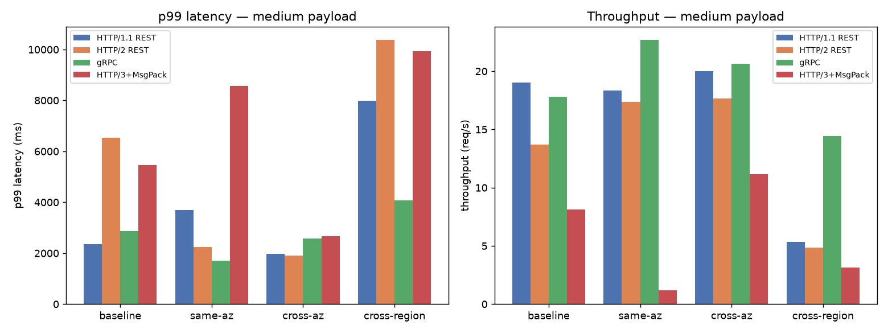
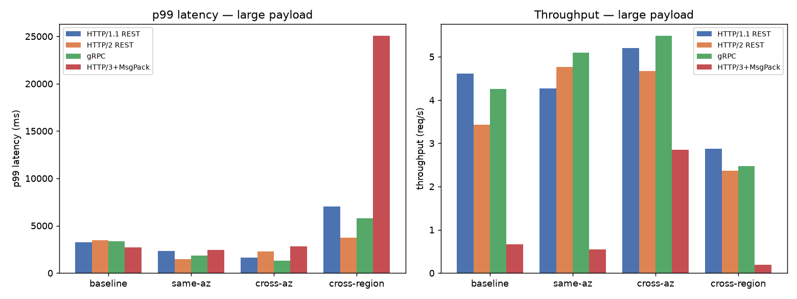
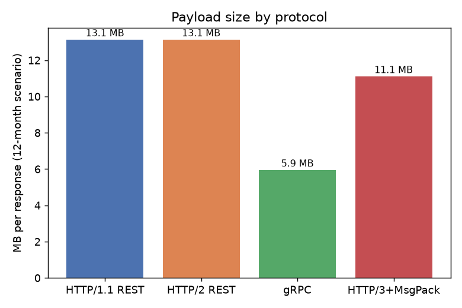
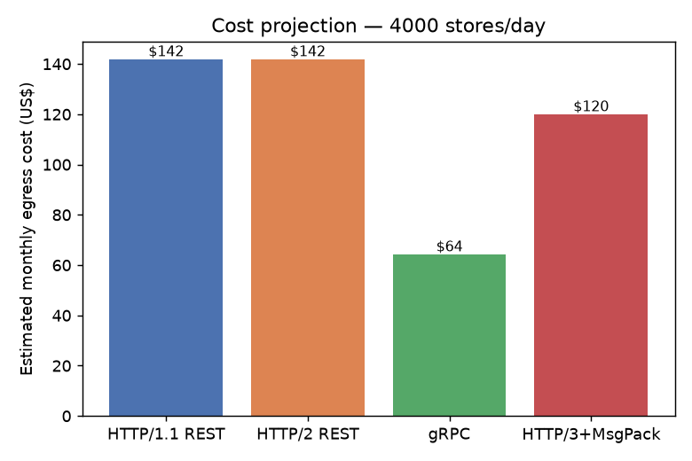
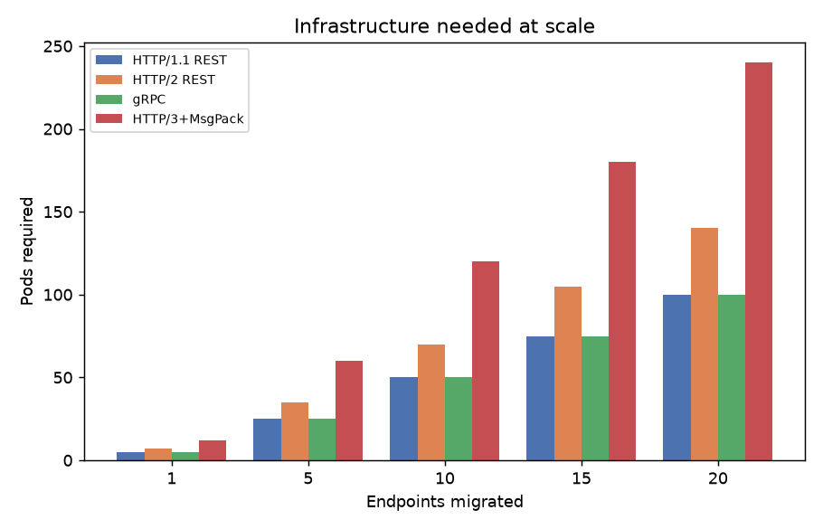
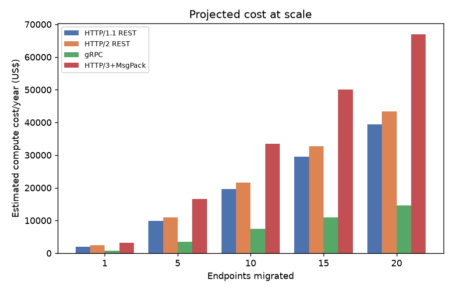
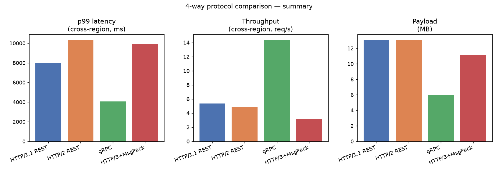

# POC: 4 protocols — HTTP/1.1 REST vs HTTP/2 REST vs gRPC vs HTTP/3 + MessagePack

🌐 [Leia isso em Português](RESULTS_4WAY.md)

**Run date:** 2026-09-21
**Environment:** local Docker Compose (Postgres 16, 4 Spring Boot 4.1 / Kotlin services, 4 nginx gateways simulating API Gateway/ALB/CDN), containers capped at 1 vCPU / 1GiB (typical EKS pod profile)

This extends the original comparison (see [RESULTS.en.md](RESULTS.en.md)), which only covered REST (HTTP/1.1, JSON) vs gRPC (HTTP/2, Protobuf). This document applies the **same methodology** (same payload scenarios, same 4 network profiles, same metrics, same chart types) to all 4 protocols side by side — without touching anything that already existed: the original `sales-service-rest` service and the `RESULTS.md`/`RESULTS.en.md` documents remain exactly as they were.

## 1. Objective and scenario

Same real use case from the original POC: a store's annual history, returning aggregated monthly sales across the store's product catalog plus that period's promotions in a single response. Business logic is identical across all 4 services (shared `sales-domain` module); only the exposition layer (protocol + serialization) differs.

| Variant | Service | Gateway | Port | Serialization |
|---|---|---|---|---|
| HTTP/1.1 REST | `sales-service-rest` (pre-existing) | `api-gateway-sim` (API Gateway) | 8443 | JSON |
| HTTP/2 REST | `sales-service-rest-h2` (new) | `api-gateway-sim-h2` (new, API Gateway) | 8543 | JSON |
| gRPC | `sales-service-grpc` (pre-existing) | `alb-grpc-sim` (ALB) | 9443 | Protobuf |
| HTTP/3 | `sales-service-msgpack` (new) | `edge-h3-sim` (new, CDN/edge) | 8843 | MessagePack |

`sales-service-rest-h2` and `sales-service-msgpack` are copies of the same use case, isolated into their own services, to isolate each variable (transport protocol, serialization format) without touching the original services.

**Why HTTP/3 needed a different architecture:** no JVM embedded server (Tomcat, Jetty, Netty) has stable server-side HTTP/3 (QUIC) support today. The production-proven approach is to terminate QUIC/TLS at a dedicated edge (CDN) and speak ordinary HTTP internally — that's what `edge-h3-sim` does: an nginx build (compiled with `--with-http_v3_module`) terminates HTTP/3 on port 8843 and proxies to `sales-service-msgpack` over plain HTTP/1.1. The backend has no idea it's sitting behind HTTP/3.

**Dataset, payload scenarios, and network profiles:** identical to the original POC —
- 50 stores, 5,000-product catalog, 12 months of history, 5 promotions/month per store
- **Medium**: last 3 months → 15,000 sales + 15 promotions per response (~3.3 MB in JSON)
- **Large**: full 12 months → 60,000 sales + 60 promotions per response (~13.1 MB in JSON)
- Network profiles via `tc`/`netem`: `baseline` (no shaping), `same-az` (0.5ms), `cross-az` (1.5ms), `cross-region` (100ms)
- **Concurrency:** 20 simultaneous requests in the medium scenario, 5 in the large one (same assumptions as the original benchmark — the large scenario is memory-bound, see section 4)
- Tools: `k6` for both REST variants (same script, just a different port), `ghz` for gRPC (unchanged), and a custom Python script built on `aioquic` for HTTP/3, since no mature load-testing tool has real HTTP/3 support today. See [benchmark/h3/README.md](../benchmark/h3/README.md).

**Important environment caveat (full note at the end):** this run has **4 application services + 4 gateways running simultaneously** on the same Docker Desktop host, versus 2+2 in the original POC — this introduces host-level CPU contention that didn't exist in the original measurement, so the **absolute values** for REST/gRPC here may differ from what's published in `RESULTS.en.md`. The **relative comparison across all 4 protocols within this same run** remains valid, and that's what this document reports.

## 2. Latency and throughput

### Legend

- **Protocol**: `REST` = JSON via `api-gateway-sim`; `REST/H2` = JSON via `api-gateway-sim-h2`; `gRPC` = Protobuf via `alb-grpc-sim`; `HTTP/3` = MessagePack via `edge-h3-sim`.
- **Scenario**: `medium` = 3-month query (~3.3MB JSON); `large` = 12-month query (~13.1MB JSON).
- **Network profile**: simulated latency via `tc`/`netem` — `baseline`, `same-az` (~0.5ms), `cross-az` (~1.5ms), `cross-region` (~100ms).
- **p50 / p95 / p99**: per-request latency percentiles, in milliseconds.
- **Throughput**: requests completed per second, at the scenario's concurrency (20 medium, 5 large).
- **Success**: percentage of requests that completed with a valid response.

| Protocol | Scenario | Profile | p50 (ms) | p95 (ms) | p99 (ms) | Throughput (req/s) | Success |
|---|---|---|---|---|---|---|---|
| REST | medium | baseline | 984 | 1791 | 2352 | 19.0 | 100% |
| REST/H2 | medium | baseline | 1079 | 5797 | 6522 | 13.7 | 100% |
| gRPC | medium | baseline | 1012 | 2700 | 2869 | 17.8 | 100% |
| HTTP/3 | medium | baseline | 2105 | 5015 | 5465 | 8.1 | 100% |
| REST | medium | same-az | 958 | 3028 | 3688 | 18.4 | 100% |
| REST/H2 | medium | same-az | 1098 | 1619 | 2245 | 17.4 | 100% |
| gRPC | medium | same-az | 844 | 1436 | 1713 | 22.7 | 100% |
| HTTP/3 | medium | same-az | 2310 | 7950 | 8568 | 1.2 | 100% |
| REST | medium | cross-az | 955 | 1473 | 1983 | 20.0 | 100% |
| REST/H2 | medium | cross-az | 1102 | 1631 | 1904 | 17.7 | 100% |
| gRPC | medium | cross-az | 905 | 1794 | 2584 | 20.6 | 100% |
| HTTP/3 | medium | cross-az | 1748 | 2223 | 2658 | 11.2 | 100% |
| REST | medium | cross-region | 2795 | 7158 | 7990 | 5.3 | 100% |
| REST/H2 | medium | cross-region | 3093 | 8720 | 10368 | 4.9 | 100% |
| gRPC | medium | cross-region | 1213 | 3545 | 4068 | 14.4 | 100% |
| HTTP/3 | medium | cross-region | 4852 | 9850 | 9929 | 3.2 | 100% |
| REST | large | baseline | 986 | 1909 | 3243 | 4.6 | 100% |
| REST/H2 | large | baseline | 1205 | 3444 | 3477 | 3.4 | 100% |
| gRPC | large | baseline | 1010 | 3217 | 3383 | 4.3 | 100% |
| HTTP/3 | large | baseline | 1628 | 2636 | 2707 | 0.7 | 100% |
| REST | large | same-az | 1110 | 1952 | 2312 | 4.3 | 100% |
| REST/H2 | large | same-az | 1026 | 1459 | 1488 | 4.8 | 100% |
| gRPC | large | same-az | 931 | 1445 | 1838 | 5.1 | 100% |
| HTTP/3 | large | same-az | 1738 | 2376 | 2442 | 0.5 | 100% |
| REST | large | cross-az | 942 | 1329 | 1622 | 5.2 | 100% |
| REST/H2 | large | cross-az | 956 | 1968 | 2279 | 4.7 | 100% |
| gRPC | large | cross-az | 909 | 1214 | 1322 | 5.5 | 100% |
| HTTP/3 | large | cross-az | 1596 | 2749 | 2844 | 2.9 | 100% |
| REST | large | cross-region | 1165 | 3099 | 7040 | 2.9 | 100% |
| REST/H2 | large | cross-region | 1744 | 3528 | 3726 | 2.4 | 100% |
| gRPC | large | cross-region | 1779 | 4743 | 5787 | 2.5 | 100% |
| HTTP/3 | large | cross-region | **24942** | **25025** | **25040** | 0.2 | 100% |

*(Generated by `benchmark/consolidate/consolidate-4way.py` from `k6`, `ghz`, and `benchmark/h3/load_test.py` output; see `benchmark/results/summary-4way.csv` for full numbers and `benchmark/results/charts-4way/` for the raw per-protocol charts.)*

**Reading the numbers:**

- **gRPC is the most consistent under poor network conditions**: in `cross-region` (medium scenario), gRPC delivers **49% lower p99 and 170% more throughput** than HTTP/1.1 REST — gRPC's multiplexed HTTP/2 amortizes the extra round-trip cost a slow network imposes better than plain HTTP/1.1. The same pattern repeats, more modestly, in `same-az`/`cross-az`.
- **HTTP/2 REST alone is not a guaranteed win**: in the large scenario (a single huge response per request, nothing to multiplex), HTTP/2 REST had the **worst p95 at baseline** (3444ms vs 1909ms for HTTP/1.1) — HTTP/2's per-stream flow-control overhead costs more than it helps when there are no multiple small requests to interleave on the same connection. In the medium scenario it sometimes wins (`same-az`, `cross-az`) and sometimes loses badly (`baseline`, `cross-region`) — a much less predictable result than gRPC's.
- **HTTP/3 + MessagePack is competitive under normal conditions but shows an anomalous behavior in large/`cross-region`**: p50 jumps to **~25 seconds**, ~13x slower than the other 3 protocols under the same 100ms delay. This was confirmed reproducible (not single-measurement noise) and is discussed in the methodology note — it looks like an artifact of how QUIC (congestion control/pacing) interacts with fixed-delay `tc`/`netem` in Docker Desktop's virtualized network, not necessarily representative of real HTTP/3 behind a production CDN (which doesn't use this network emulation).
- **Under high concurrency and a shared host (this run), REST/HTTP1.1 and gRPC are close at `baseline`** — unlike the original POC, which ran only 2 services and showed gRPC more clearly ahead already at baseline. This is expected: with 8 services + 4 gateways active on the same host, CPU contention at the Docker Desktop VM level reduces the headroom each container had on its own. gRPC's advantage is still evident, but shows up more clearly in the adverse network profiles than in the isolated baseline.

## 3. Payload size

Measured byte-for-byte on the wire (same store, same period, large scenario):

| Protocol | Bytes | Reduction vs JSON |
|---|---|---|
| REST (JSON) | 13,119,848 (~13.1 MB) | — |
| REST/H2 (JSON) | 13,119,848 (~13.1 MB) | 0% (same serialization) |
| gRPC (Protobuf) | 5,934,663 (~5.9 MB) | **54.8%** |
| HTTP/3 (MessagePack) | 11,093,493 (~11.1 MB) | **15.4%** |

MessagePack shrinks the payload by being binary and more compact than JSON, but falls well short of Protobuf: MessagePack still carries field names and has no compiled schema, so most of Protobuf's size advantage (encoding fields by number, not name) doesn't apply.

## 4. CPU and memory under load

Sampled via `docker stats` during the large scenario, concurrency 5, ~20s of load:

| Service | CPU under load | Memory under load |
|---|---|---|
| sales-service-rest | 35-102% of 1 vCPU | 33-84% of 1GiB |
| sales-service-rest-h2 | 12-103% of 1 vCPU | 66-89% of 1GiB |
| sales-service-grpc | 0-104% of 1 vCPU | 60-81% of 1GiB |
| sales-service-msgpack | 9-100% of 1 vCPU | 29-92% of 1GiB |

**A finding that repeats from the original POC, now doubled:** during the full 32-combination matrix run (4 protocols × 2 scenarios × 4 profiles), **both `sales-service-rest` and `sales-service-rest-h2` got killed for running out of memory (OOMKilled) at least once**, as did `sales-service-grpc` and `sales-service-msgpack` at isolated moments of higher concurrency (20 simultaneous in the medium scenario). This isn't a misconfiguration of the new services — it's the same memory limitation documented in the original POC (section 4 of [RESULTS.en.md](RESULTS.en.md)): holding tens of thousands of entities/objects in memory for several concurrent requests saturates a 1GiB limit fast, regardless of protocol. Smaller payloads (Protobuf, MessagePack) suffer proportionally less, but aren't immune under high enough concurrency.

## 5. Trade-offs the numbers don't show

The qualitative gRPC trade-offs already documented in section 5 of [RESULTS.en.md](RESULTS.en.md) (unreadable payload, stub generation, browser support, AWS gateway asymmetry, observability maturity, message size limit) still apply and aren't repeated here. Trade-offs specific to the 2 new variants:

- **HTTP/2 REST**: gets HTTP/2 multiplexing without changing serialization (stays JSON, stays REST, stays readable with Postman/curl) — the lowest-effort path for an incremental improvement without rewriting contracts. But, as shown in section 2, that gain **isn't guaranteed** for every traffic pattern; for very large single responses it can be worse than plain HTTP/1.1.
- **HTTP/3 + MessagePack**: requires a real, new piece of infrastructure (an edge that terminates QUIC — CDN or dedicated proxy), not just application configuration, since the JVM doesn't serve HTTP/3 natively. That's an architectural change, not a library swap. MessagePack, in turn, has much more limited tooling support than JSON or Protobuf — there's no "native Postman" for MessagePack, and debugging a captured payload requires a tool that understands the format.

## 6. Possible cost reduction

Same methodology as section 6 of [RESULTS.en.md](RESULTS.en.md): an order-of-magnitude estimate, not a precise financial forecast.

### Simulation: 4,000 stores querying the endpoint 1x/day (12-month history)

| | REST (JSON) | REST/H2 (JSON) | gRPC (Protobuf) | HTTP/3 (MessagePack) |
|---|---|---|---|---|
| Volume/day | 52.5 GB | 52.5 GB | 23.7 GB | 44.4 GB |
| Volume/month | 1,574 GB | 1,574 GB | 712 GB | 1,331 GB |
| Volume/year | 19.2 TB | 19.2 TB | 8.7 TB | 16.2 TB |
| Estimated annual cost* | US$ 1,724 | US$ 1,724 | **US$ 780** | US$ 1,458 |
| Savings vs REST | — | 0% | **US$ 944/yr (54.8%)** | US$ 266/yr (15.4%) |

*\*AWS reference of US$0.09/GB for internet egress — the percentage reduction is the same regardless of the rate used.*

Same caveat as the original POC: this is a linear extrapolation over this POC's current payload (smaller than the team's real production payload). The directional conclusion (gRPC > HTTP/3+MessagePack > HTTP/2 REST ≈ HTTP/1.1 REST in egress reduction) should hold proportionally with a larger payload.

### Compute cost: pods needed for the same throughput

**Important caveat:** because of the host contention described in section 1 (8 simultaneous services in this run), gRPC's throughput advantage over REST at `medium/baseline` **didn't repeat as cleanly** as in the original POC — here gRPC (17.8 req/s) came in slightly behind HTTP/1.1 REST (19.0 req/s) at that specific point, even though it clearly wins at the network-latency profiles (`same-az`, `cross-az`, `cross-region`, section 2). The table below uses this run's measured `medium/baseline` throughput, so it reflects this more crowded environment — treat it as an illustration of the method, not a definitive number, and prefer the non-baseline network profiles (more representative of real cross-AZ/cross-region traffic) to judge gRPC's real advantage.

Assumptions: 5 reference pods per endpoint (1 vCPU/1GiB), AWS Fargate cost ≈ US$32.80/pod/month.

| Endpoints migrated | REST pods | REST/H2 pods | gRPC pods | HTTP/3 pods |
|---|---|---|---|---|
| 1 | 5 | 7 | 5 | 12 |
| 5 | 25 | 35 | 25 | 60 |
| **10** | **50** | **70** | **50** | **120** |
| 15 | 75 | 105 | 75 | 180 |
| 20 | 100 | 140 | 100 | 240 |

**Why HTTP/3+MessagePack needs more pods in this table:** the Python/`aioquic` load-test script (needed because no mature tool supports HTTP/3) has much lower client-side throughput than k6/ghz (compiled, multi-threaded binaries) — part of the measured "throughput" difference is a load-testing-tool limitation, not the protocol/service itself. This number should be read with more caution than the others.

## 7. Conclusion and recommendation

The original POC's conclusion (section 8 of [RESULTS.en.md](RESULTS.en.md)) — selective gRPC adoption for internal endpoints with high concurrent traffic and/or network-latency sensitivity — **still stands** with this additional data. The 2 new variants reinforce specific points:

- **HTTP/2 REST** is the lowest-effort option for improving without changing serialization, but the data shows the gain depends heavily on the traffic pattern — it's not the "always positive" swap it's sometimes sold as. Worth measuring before adopting, not assuming.
- **HTTP/3 + MessagePack** is technically viable and reduces payload (15% vs JSON), but requires a new piece of infrastructure (a QUIC-terminating edge) and, in the tested environment, showed an abrupt and reproducible degradation under high network latency that needs deeper investigation before any production decision — not a result to ignore or generalize without more data.
- **gRPC remains the option with the most favorable trade-off** among the 4, especially under adverse network conditions — the more realistic scenario for cross-AZ/cross-region production traffic.

---

## Quick summary

| | REST (JSON) | REST/H2 (JSON) | gRPC (Protobuf) | HTTP/3 (MsgPack) |
|---|---|---|---|---|
| p99, poor network (medium/cross-region) | 7,990 ms | 10,368 ms | **4,068 ms** | 9,929 ms |
| Throughput, poor network (medium/cross-region) | 5.3 req/s | 4.9 req/s | **14.4 req/s** | 3.2 req/s |
| Payload size | 13.1 MB | 13.1 MB | **5.9 MB** | 11.1 MB |
| Egress reduction vs REST | — | 0% | **54.8%** | 15.4% |
| Estimated annual cost, 4,000 stores/day | US$ 1,724 | US$ 1,724 | **US$ 780** | US$ 1,458 |

gRPC wins on all three core fronts (tail latency under poor network, throughput under poor network, payload size/cost) — the same pattern as the original POC. The two new variants land in between: HTTP/2 REST lowers the adoption cost but doesn't deliver a consistent performance gain; HTTP/3+MessagePack modestly reduces payload but introduces a new infrastructure dependency and a poor-network behavior that needs more investigation before any production recommendation.

---

## Methodological note

- **A more crowded environment than the original POC:** this run has 4 application services + 4 gateways running simultaneously (vs. 2+2 in the original POC), all on the same Docker Desktop host. This introduces VM-level CPU contention that didn't exist in the original measurement — the absolute REST/gRPC values here are **not directly comparable** to `RESULTS.en.md`; the relative comparison across all 4 protocols within this same run is the reliable data point.
- **HTTP/3 anomaly at `cross-region`/large:** p50 climbs to ~25 seconds, ~13x slower than the other 3 protocols under the same fixed 100ms delay — confirmed reproducible across 2 independent runs. The most likely explanation is an interaction between QUIC's congestion control/pacing and `tc`/`netem`'s fixed-delay emulation in Docker Desktop's virtualized network (TCP-based traffic didn't show this effect under the same delay). This is a local test-environment limitation worth investigating further, not necessarily a characteristic of HTTP/3 in production behind a real CDN — but it also shouldn't be dismissed without more testing in a non-virtualized environment.
- **Out-of-memory events during the run:** `sales-service-rest`, `sales-service-rest-h2`, and `sales-service-msgpack` were each restarted at least once during the full 32-test matrix run, for hitting the 1GiB limit under 20-concurrent load with the large payload. Each service was restarted and that specific run redone before being recorded in this table — no final number reported here comes from a run that suffered an OOM mid-test.
- All tests had a warm-up round before measurement — without it, the first gRPC measurement in the medium scenario showed a clear bimodal distribution (normal p50, but p75+ jumping to 19.5 seconds), a JIT warm-up/connection-pool-initialization artifact, not a protocol characteristic.
- Network profiles use **fixed delay, no jitter or packet loss** — same decision and rationale documented in the original POC.
- All 4 services' containers run with explicit `-XX:MaxRAMPercentage=75.0`, same configuration as the original POC.
